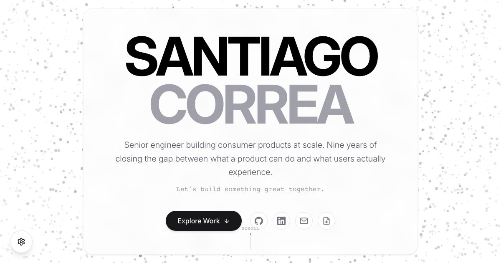

# Santiago Correa Portfolio

A high-performance, award-winning portfolio site built with modern web technologies.



## 🚀 Tech Stack

- **Framework**: [Remix](https://remix.run/) (React Router 7)
- **Language**: TypeScript
- **Styling**: [Tailwind CSS v4](https://tailwindcss.com/)
- **Animation**: [Framer Motion](https://www.framer.com/motion/)
- **3D Visuals**: [React Three Fiber](https://docs.pmnd.rs/react-three-fiber/) (Three.js)
- **State Management**: [Zustand](https://github.com/pmndrs/zustand)
- **Internationalization**: i18next

## ✨ Key Features

- **"Quantum Field"**: Interactive 3D particle background system.
- **Zero-Latency Navigation**: Single Page Application feel with Remix loaders.
- **Theme System**: Robust Dark/Light mode with system preference detection and persistence.
- **Kinetic UI**: Magnetic buttons, scroll-driven animations, and reveal effects.
- **Internationalization**: Fully localized in English, Spanish, German, and French.

## 🛠️ Development

### Prerequisites

- Node.js (v20+)
- pnpm

### Setup

1.  **Install Dependencies**

    ```bash
    pnpm install
    ```

2.  **Start Dev Server**

    ```bash
    pnpm run dev
    ```

3.  **Build for Production**
    ```bash
    pnpm run build
    ```

## 📐 Engineering Standards

See [ENGINEERING_GUIDELINES.md](./ENGINEERING_GUIDELINES.md) for detailed architectural documentation.

## 📂 Project Structure

- `app/routes`: Remix routing and server-side loaders.
- `app/components`: Shared UI components (Atomic Design).
- `app/features`: Feature-specific logic (Hero, Projects, Skills).
- `app/store`: Global Zustand stores.
- `app/data`: Static content data.

## 🌍 Localization

Translations are managed in `public/locales`.
To add a new language:

1. Create a folder in `public/locales/{code}`.
2. Add `translation.json`.
3. Update `app/i18n.ts` configuration.

## 📄 License

MIT © [Santiago Correa](https://github.com/scorrea-dev)
